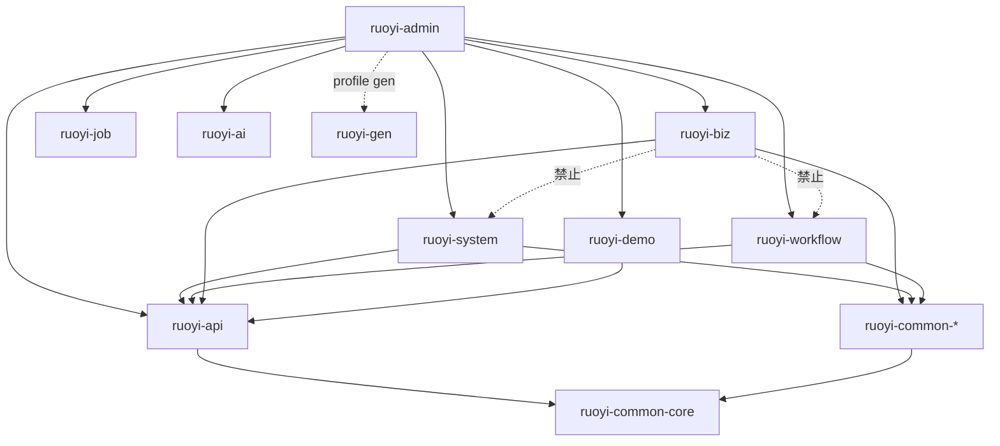

# 模块组成

对应底座版本：1.0.19，生成日期：2026-09-28

## 一、模块清单

### 顶层目录

| 路径 | 职责 | 对外提供 | 依赖 / 来源 |
|---|---|---|---|
| `backend/` | 后端 Maven 多模块工程，artifact 为 `ruoyi-vue-plus` | 可执行的 `ruoyi-admin.jar` | subtree RuoYi-Vue-Plus 6.X |
| `frontend/` | 管理端 SPA | Vite dev server 或静态构建产物 | subtree plus-ui 6.X |
| `sql/biz/` | 每个变更一个 `<change-id>.sql`（DDL、字典、菜单） | 冒烟执行器导入的增量脚本 | 本仓库；依赖 `backend/script/sql/ry_vue.sql` |
| `acceptance/` | 代理指南、执行器、验收客户端、系统冒烟、变更验收、UI 回归资产 | StoryLoop 各层命令的入口 | 本仓库 |
| `openspec/` | 活规格 `specs/`、变更归档 `changes/`、本知识库 `foundation/` | 需求真源 | 本仓库，由流程生成 |
| `infra/` | `docker-compose.yml`：容器 `ruoyi-mysql` 和 `ruoyi-redis` | 本地、冒烟和 CI 共用的中间件 | 本仓库 |
| `.github/workflows/` | `ci.yml`（按层划分的流水线）、`codeql.yml`（每周 SAST） | GitHub 上的门禁 | 本仓库，受保护路径 |
| `reports/storyloop/` | 每个变更的验收证据报告 | `report.md` | 流程生成 |
| `.storyloop/`（git 忽略） | 引擎状态：`config.json`、`baseline.json`、base-proposals、evidence、state | — | 流程状态 |

### 后端 Maven 反应堆（`backend/pom.xml` 的 `<modules>`）

| 模块 | 职责 | 对外提供 | 依赖 |
|---|---|---|---|
| `ruoyi-admin` | Web 入口，打包成 `ruoyi-admin.jar`；登录、注册、验证码 | `org.dromara.DromaraApplication`；`AuthController`（`/auth`）、`CaptchaController`、`IndexController`；`SysLoginService`、`IAuthStrategy` 的各实现 | 全部业务模块（`ruoyi-gen` 通过默认激活的 profile `gen` 引入）、`ruoyi-api`、`ruoyi-common-doc/social/mail/mcp`、MySQL 驱动 |
| `ruoyi-api` | 跨模块调用的接口与 DTO，是业务模块之间唯一的通道 | `org.dromara.system.api.*`（`UserService`、`DeptService`、`RoleService`、`PostService`、`ConfigService`、`OssService`、`MessageService`、`TaskAssigneeService`，以及 `LoginUser` 等 model）；`org.dromara.workflow.api.*`（`WorkflowService` 与流程事件） | `ruoyi-common-core` |
| `ruoyi-common`（BOM 加 24 个子模块） | 横切基础设施，见下表 | 基类、注解、工具、自动配置 | 以 `ruoyi-common-core` 为底 |
| `ruoyi-modules` | 业务模块的父 pom（集成点）：统一给子模块加 test 作用域的 `spring-boot-starter-test`，并声明 failsafe、spotless、checkstyle | 见下表 | `ruoyi-api`、`ruoyi-common-*` |
| `ruoyi-extend` | 独立部署的应用，不打进 admin：`ruoyi-monitor-admin`、`ruoyi-snailjob-server`、`ruoyi-snailai-server` | Spring Boot Admin、SnailJob 调度中心、Snail AI 服务端 | 独立 |

### ruoyi-common 子模块

| 模块 | 职责 | 关键类 |
|---|---|---|
| core | 通用域对象、常量、异常、工具、校验分组与校验注解 | `R`、`PageResult`、`ServiceException`、`SystemConstants`、`CacheNames`、`DictService`、`PermissionService`、`MapstructUtils`、`StringUtils`、`StreamUtils`、`ValidatorUtils`、`AddGroup/EditGroup/QueryGroup`、`@DictPattern` |
| mybatis | MyBatis-Plus 配置、Mapper 基类、分页、数据权限、审计字段填充 | `BaseEntity`、`BaseMapperPlus`、`PageQuery`、`@DataPermission`、`MybatisPlusConfig`、`InjectionMetaObjectHandler`、`MybatisExceptionHandler` |
| web | 控制器基类、全局异常、过滤器、验证码、国际化、耗时拦截 | `BaseController`、`GlobalExceptionHandler`、`FilterConfig`、`XssFilter`、`RepeatableFilter`、`PlusWebInvokeTimeInterceptor` |
| satoken | Sa-Token 集成与登录上下文 | `LoginHelper`、`SaPermissionImpl`、`PlusSaTokenDao`、`SaTokenExceptionHandler` |
| security | 路由拦截与免登录放行 | `SecurityConfig`、`SecurityProperties`、`AllUrlHandler` |
| redis | Redisson、Spring Cache、分布式锁、限流、防重复提交 | `RedisUtils`、`CacheUtils`、`SequenceUtils`、`@RepeatSubmit`、`@RateLimiter` |
| log | 操作日志注解与事件 | `@Log`、`BusinessType`、`LogAspect`、`OperLogEvent` |
| excel | 基于 Fesod 的 Excel 导入导出 | `ExcelBuilder`、`@ExcelDictFormat`、`ExcelDictConvert` |
| translation / sensitive / encrypt / json | 响应翻译、响应脱敏、接口与字段加密、Jackson 配置 | `@Translation`、`@Sensitive`、`@ApiEncrypt`、`@EncryptField`、`JsonUtils`、`BigNumberSerializer` |
| doc / oss / push / job | springdoc 接口文档、S3 对象存储、SSE/WebSocket 推送、SnailJob 客户端 | `SpringDocConfig`、`OssFactory`、`SseController`、`SnailJobConfig` |
| mail / sms / social / liteflow | 邮件、短信（sms4j）、第三方登录（JustAuth）、规则编排 | `MailBuilder`、`SocialUtils`、`LiteFlowUtils` |
| elasticsearch / mqtt / ai / mcp | Easy-Es、mica-mqtt、Snail AI、Spring AI MCP，dev 与 smoke 运行档里大多关闭 | 见 `architecture.md` |
| bom | 内部 common 模块的版本清单 | `ruoyi-common-bom/pom.xml`（集成点） |

### ruoyi-modules 子模块（可变区）

| 模块 | 包 | 职责 | 路由前缀 |
|---|---|---|---|
| ruoyi-system | `org.dromara.system` | 用户、角色、菜单、部门、岗位、字典、参数、通知、客户端、OSS、社交账号、站内消息、在线用户、日志、缓存监控；实现 `ruoyi-api` 的系统接口、core 的 `DictService` 和 `PermissionService` | `/system/**`、`/monitor/**`、`/resource/oss/**`、`/resource/message` |
| ruoyi-workflow | `org.dromara.workflow` | Warm-Flow 工作流：分类、定义、实例、任务、SpEL、请假示例；实现 `WorkflowService` | `/workflow/**` |
| ruoyi-gen | `org.dromara.gen` | 代码生成器，FreeMarker 模板在 `src/main/resources/fm/**` | `/tool/gen` |
| ruoyi-demo | `org.dromara.demo` | 上游演示，单表 `TestDemo*` 是 AGENT_GUIDE 指定的参考实现 | `/demo/**`、`/es`、`/swagger/demo` |
| ruoyi-job | `org.dromara.job` | SnailJob 执行器示例 | 无 HTTP 路由 |
| ruoyi-ai | `org.dromara.ai` | Snail AI 用户注册 | `/snail-ai` |
| **ruoyi-biz** | `org.dromara.biz` | **StoryLoop 业务落点**：`supplier`（供应商）、`purchase`（采购单）；只有这个模块绑定了 spotless 和 checkstyle | `/biz/**` |

`ruoyi-biz/pom.xml`（**集成点**）当前的依赖为 `ruoyi-common-core`、`ruoyi-api`，以及 `ruoyi-common-doc/redis/mybatis/log/excel/security/web/translation/sensitive/encrypt`。build 部分绑定了 `spotless-maven-plugin` 和 `maven-checkstyle-plugin`，版本和配置来自父 pom 的 `pluginManagement`。

## 二、依赖方向

- 业务模块之间不直接依赖（已对照各模块 pom）。跨模块能力只能从两处获取：`ruoyi-api` 的接口（实现在 `ruoyi-system` 或 `ruoyi-workflow`），以及 `ruoyi-common-core` 的 `DictService` 和 `PermissionService`。
- **禁止**：`ruoyi-biz` 注入 `ruoyi-system` 的 `ISys*Service` 或 Mapper，或者依赖 `ruoyi-workflow` 的实现类。
- 同在 `ruoyi-biz` 里的功能可以直接互相注入，例如 `BizPurchaseOrderServiceImpl` 注入了 `IBizSupplierService`。
- `ruoyi-common-*` 之间可以相互依赖，但 core 在最底层；`ruoyi-api` 只依赖 core。

## 三、可变区与底座

- **可变区**（module_roots）：`backend/ruoyi-modules`、`frontend/src`、`frontend/public`、`sql/biz`。
  - 业务：`backend/ruoyi-modules/ruoyi-biz/**`、`frontend/src/api/biz/**`、`frontend/src/views/biz/**`、`sql/biz/*.sql`。
  - 上游（虽在可变区，只在改动现有系统功能时才碰）：`ruoyi-system`、`ruoyi-workflow`、`ruoyi-gen`、`ruoyi-demo`、`ruoyi-job`、`ruoyi-ai`，以及 `frontend/src` 下除 `api/biz`、`views/biz` 以外的目录。
- **集成点**（integration_paths，属于底座，改动要走 BASE 提案）：`backend/pom.xml`、`backend/ruoyi-admin/pom.xml`、`backend/ruoyi-api/pom.xml`、`backend/ruoyi-common/pom.xml`、`backend/ruoyi-common/ruoyi-common-bom/pom.xml`、`backend/ruoyi-modules/pom.xml`、`backend/ruoyi-modules/ruoyi-biz/pom.xml`、`frontend/package.json`、`frontend/pnpm-lock.yaml`、`frontend/pnpm-workspace.yaml`。
- **受保护路径**（`.storyloop/config.json` 的 `protected_paths`）：`.github/workflows/ci.yml`、`.github/workflows/codeql.yml`。
- **流程生成路径**（`generated_paths`，实现角色不写）：`openspec/changes`、`openspec/specs`、`acceptance/changes`、`acceptance/smoke`、`acceptance/ui`、`reports/storyloop`。
- **可变区里的底座文件**：`backend/ruoyi-modules/checkstyle-biz.xml` 位于可变区目录下，但它是检查层的规则文件（BASE-20260923-005 引入），不要在功能变更里改。
- **scratch**（`acceptance/storyloop-settings.json` 的 `scratch_paths`，构建可以产生）：`target`、`node_modules`、`dist`、`logs`、`__pycache__`、`.flattened-pom.xml`、`frontend/src/types/auto-imports.d.ts`、`frontend/src/types/components.d.ts`。其他被 git 忽略的文件一律不要产生。
- `candidate_allow`：候选副本里允许出现 `frontend/.env.development` 和 `frontend/.env.production`，但它们仍是底座。
- 其余底座：`ruoyi-common/**`、`ruoyi-api/**`、`ruoyi-admin/**`（含 `application*.yml`）、`backend/script/sql/**`、`acceptance/tools/**`、`frontend/vite.config.ts`、`frontend/vite/**`、`frontend/.env.*`、`tsconfig.json`、`.oxlintrc.json`、`.oxfmtrc.json`、`.gitleaks.toml`、`infra/**`。

## 四、前端结构（`frontend/src`）

| 目录 | 职责 |
|---|---|
| `api/<module>/<feature>/index.ts`、`types.ts` | 按后端路由组织的请求封装和类型。`api/types.ts` 定义 `PageResult`；`api/menu.ts` 提供 `getRouters`；业务在 `api/biz/{supplier,purchaseOrder}` |
| `views/<module>/<feature>/index.vue` | 页面。业务页在 `views/biz/{supplier,purchaseOrder}`，其余来自上游 |
| `hooks/**` | 组合函数：`async/useLoading`、`dialog/useFormDialog`、`dialog/useDialogState`、`form/useSearchReset`、`form/useSearchToggle`、`form/useDateRangeQuery`、`table/useTableSelection`、`table/useTableSortQuery`、`table/useFullHeightTable`、`tree/*` |
| `components/**` | 全局组件，由 unplugin-vue-components 自动注册（`Pagination`、`RightToolbar`、`DictTag` 等） |
| `utils/**` | `request.ts`（axios 实例和 `download`）、`dict.ts`（`useDict`）、`ruoyi.ts`、`auth.ts`、`permission.ts`、`crypto.ts`、`validate.ts` |
| `plugins/**` | `modal`、`tab`、`cache`、`download`、`auth`，挂到 `$modal` 等全局属性 |
| `directive/**` | `v-hasPermi`、`v-hasRoles`、`v-copyText` |
| `store/modules/**` | Pinia 仓库：`user`、`permission`（动态路由）、`dict`、`settings`、`tagsView`、`app`、`notice` |
| `router/index.ts` | 常量路由（登录、注册、404、首页、个人中心）；业务路由不写在这里 |
| `permission.ts` | 全局路由守卫：拉取用户信息，生成动态路由 |
| `layout/**`、`assets/**`、`lang/**`、`types/**` | 布局、样式（含 `assets/styles/components/page-shell`）、i18n、全局类型（`types/global.d.ts`，以及生成的 `auto-imports.d.ts`、`components.d.ts`） |
| `**/*.test.ts` | vitest 单元测试，放在源码旁边：`api/biz/supplier/{types,query}.test.ts`、`views/biz/purchaseOrder/{index,remarkOrder}.test.ts` |

## 附：acceptance/ 结构

- `AGENT_GUIDE.md`：各角色的约定，StoryLoop 通过 `--guide` 注入（`.storyloop/config.json` 的 `agent_command`）。
- `storyloop-settings.json`：各层命令、`test_roots`、module_roots、integration_paths、scratch。
- `tools/`：`ruoyi_smoke.py`、`smoke_harness.py`、`ruoyi_client.py`、`frontend_unit.py`、`frontend_check.py`、`run_manifest.py`、`ui_regression.py`、`playwright.config.ts`、`playwright-agents/`、`selftest_backend.py`、`selftest_ui.spec.ts`、`tests/test_frontend_unit.py`。
- `changes/<change-id>/`：变更验收套件（manifest、`test_*.py`、`*.spec.ts`），目前有 FEAT-20260923-002、FEAT-20260924-001、FEAT-20260924-002、FEAT-20260928-002。
- `smoke/manifest.json` 加 `smoke/purchase-order/`：项目级系统冒烟。`smoke/FEAT-*/` 是早期按变更划分的套件。
- `ui/supplier-management/`：`plan.md` 和 4 个已验证的 Playwright 回归用例。
